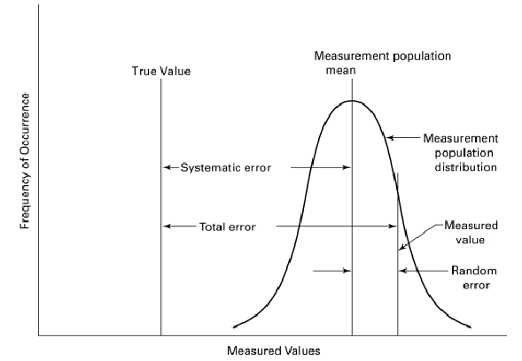
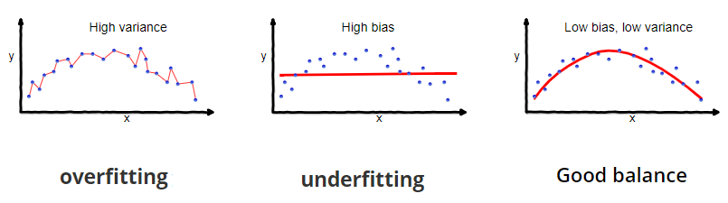

# Bias-Variance Tradeoff


_More reading:_ [_Bias-Variance Tradeoff \(Wikipedia\)_](https://en.wikipedia.org/wiki/Bias-variance_tradeoff)


## What is bias error?

In statistics, the **bias** \(or **bias function**\) of an estimator is the difference between the estimator's expected value and the true value of the parameter being estimated. An estimator or decision rule with zero bias is called **unbiased.** So. it measures the difference between the estimated value by a model or measurement method and the real one.

**Bias** refers to the difference between the true or correct value of some quantity and a measurement or estimate of that quantity. In principle it cannot be calculated therefore unless that true or correct value is known, although this problem bites to varying degrees.

* In the simplest kind of problem, the true value is known \(as when the centre of a target is visible and the distance of a shot from the centre can be measured; this is a common analogy\) and bias is then usually calculated as the difference between the true value and the mean \(or occasionally some other summary\) of measurements or estimates.
* In other problems, some careful method is regarded as the state of the art and so yielding the best possible measurements, and so other methods are regarded as more or less biased according to their degree of systematic departure from the best method \(in some fields termed a gold standard\).
* In yet other problems, we have one or more methods all deficient to some degree and assessment of bias is then difficult or impossible. It is then tempting, or possibly even natural, to change the question and judge truth according to consistency between methods.

## What is variance error?

In statistics, it is defined as the squared deviation of a given variable from its mean. It measures how far a set of values is spread out from their average value.

## Bias vs Variance

This **tradeoff** is the property of a set of predictive models whereby models with a lower [bias](https://en.wikipedia.org/wiki/Bias_of_an_estimator) in [parameter](https://en.wikipedia.org/wiki/Statistical_parameter) [estimation](https://en.wikipedia.org/wiki/Estimation_theory) have a higher [variance](https://en.wikipedia.org/wiki/Variance) of the parameter estimates across [samples](https://en.wikipedia.org/wiki/Sample_%28statistics%29), and vice versa. The **bias–variance dilemma** or **problem** is the conflict in trying to simultaneously minimize these two sources of [error](https://en.wikipedia.org/wiki/Errors_and_residuals_in_statistics) that prevent [supervised learning](https://en.wikipedia.org/wiki/Supervised_learning) algorithms from generalizing beyond their [training set](https://en.wikipedia.org/wiki/Training_set).

A high **bias** error is due to erroneous or overly **simplistic assumptions in the learning algorithm** you’re using. This can lead to the model **underfitting** your data, making it hard for it to have high predictive accuracy and for you to generalize your knowledge from the training set to the test set.

A high **variance** error is due to **too much complexity** in the learning algorithm you’re using. This leads to the algorithm being highly sensitive to high degrees of variation in your training data, which can lead your model to **overfit** the data. You’ll be carrying **too much noise** from your training data for your model to be very useful for your test data.

The **bias-variance decomposition** essentially **decomposes the learning error** from any algorithm by adding the bias, the variance and a bit of irreducible error due to noise in the underlying dataset. Essentially, if you make the model more complex and add more variables, you’ll lose bias but gain some variance — in order to get the optimally reduced amount of error, you’ll have to tradeoff bias and variance. You don’t want either high bias or high variance in your model.


total\_error = bias\_error² + variance\_error + irreducible\_error


Some ways to achieve the Bias-Variance Tradeoff:

* By minimizing the total error
  * Generally resampling based measures such as **cross-validation** should be preferred over theoretical measures such as [Aikake’s Information Criteria](http://www.statisticshowto.com/akaikes-information-criterion/).
* Using **Bagging** and **Resampling** techniques
  * One modeling algorithm that makes use of bagging is **Random Forests**. Here, the bias of the full model is equivalent to the bias of a single decision tree–which itself has high variance. By creating many of these trees, in effect a “forest”, and then averaging them the variance of the final model can be greatly reduced over that of a single tree.
* Adjusting minor values in algorithms
  * Both the k-nearest algorithms and Support Vector Machines\(SVM\) algorithms have low bias and high variance. But the trade-offs in both these cases can be changed. 
    * In the K-nearest algorithm, the value of k can be increased, which would simultaneously increase the number of neighbors that contribute to the prediction. This in turn would increase the bias of the model. 
    * Whereas, in the SVM algorithm, the trade-off can be changed by an increase in the C parameter that would influence the violations of the margin allowed in the training data. This will increase the bias but decrease the variance.
* Using a proper Machine learning workflow with good data splits, cross-validation...!

