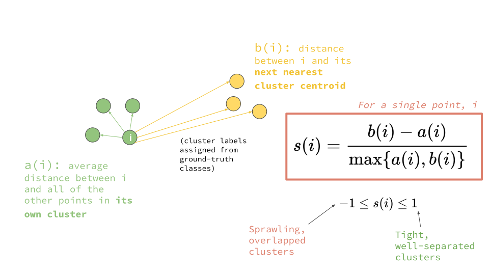

# Clustering metrics


_Sources:_

* \_\_[_K-Means Clustering: From A to Z \(Towards Data Science\)_](https://towardsdatascience.com/k-means-clustering-from-a-to-z-f6242a314e9a)\_\_
* \_\_[_Clustering performance evaluation \(Scikit Learn\)_](https://scikit-learn.org/stable/modules/clustering.html#clustering-performance-evaluation)\_\_
* \_\_[_The Silhouette Loss Function: Metric Learning with a Cluster Validity Index_](https://platform.ai/blog/page/11/the-silhouette-loss-function-metric-learning-with-a-cluster-validity-index/)\_\_


It measures clustering quality based on data information. Theses metrics evaluate how good is the clustering structure with no need for external information.

## Inertia

* Also called **within-cluster sum-of-squares** criterion.
* Tells **how far away the points within a cluster** are. 
* The range of the score is: $$[0, +\infty ) $$. So, the **lowest is better**.

$$
\sum_{i=0}^{n}\min_{\mu_j \in C}(||x_i - \mu_j||^2) \\ \text{where } \mu_j  \text{ is the centroid of each cluster and } x_i \text{ a data point.}
$$

## Silhouette score

* Tells **how far away** the instances in one cluster are, **from the instances of another cluster**. 
* The range of the score is $$[ -1, 1]$$. The **highest is better**.

