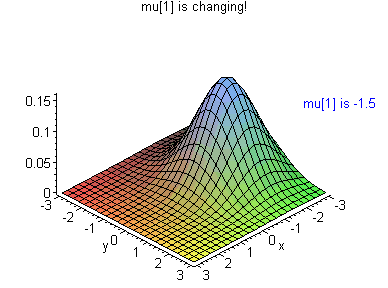

# Distributions


_Sources:_

* [_About probability distributions \(Statistics How To\)_](https://www.statisticshowto.datasciencecentral.com/probability-distribution/)\_\_
* \_\_[_Skewness \(Math is Fun\)_](https://www.mathsisfun.com/data/skewness.html)\_\_
* \_\_[_How do I determine whether my data are normal?
   \(Psychwiki.com\)_](http://www.psychwiki.com/wiki/How_do_I_determine_whether_my_data_are_normal%3F)\_\_
* \_\_[_Skew and Kurtosis: 2 Important Statistics terms you need to know in Data Science
   \(Diva Jain\)_](https://codeburst.io/2-important-statistics-terms-you-need-to-know-in-data-science-skewness-and-kurtosis-388fef94eeaa)\_\_


## Continuous distributions

### Uniform

A uniform distribution, also called a **rectangular distribution**, is a probability distribution that has **constant probability**.


This distribution is defined by **two parameters**: minimum $$a$$ and maximum $$b$$. So, for a random variable $$Z \sim Uniform(a, b)$$. And the expected value will be: $$E(X) = \frac{a+b}{2}$$.

### Normal


A normal distribution, sometimes called the bell curve, is a distribution that occurs naturally in many situations. It is expressed as $$Z \sim Norm(\mu, \sigma²)$$ It has some properties:

* The [mean, mode and median](https://www.statisticshowto.datasciencecentral.com/probability-and-statistics/statistics-definitions/mean-median-mode/) are all equal.
* The curve is symmetric at the center \(i.e. around the mean, μ\).
* Exactly half of the values are to the left of center and exactly half the values are to the right.
* The total area under the curve is 1.

#### How to find out if a sample has a normal distribution?

* Plotting data using an histogram may give an intuitive insight.
* Also, a [Normal Q-Q Plot](https://docs.scipy.org/doc/scipy/reference/generated/scipy.stats.probplot.html) provides a graphical way to determine the level of normality.
* The [Kolmogorov-Smirnov test ](https://en.wikipedia.org/wiki/Kolmogorov%E2%80%93Smirnov_test)and [Shapiro-Wilk test](https://en.wikipedia.org/wiki/Shapiro%E2%80%93Wilk_test) are designed to test normality by comparing your data to a normal distribution with the same mean and standard deviation of the sample. If the test is NOT significant, then the data are normal, so any value above .05 indicates normality.
* Measuring [kurtosis ](distributions.md#about-kurtosis)and [skewness](distributions.md#about-skewed-distributions) and compare with the normal to see how symmetric and sharp it is compared to it.
* Measuring the square error with respec to a normal with same mean and variance.

#### When a normal distribution is said to be skewed?

A distribution is skewed when one of the tails is longer. Thus, the shape of the distribution is asymetrical. More info about this topic on its own [section](distributions.md#about-skewed-distributions).

### Lognormal

A lognormal \(or Galton\) distribution is a probability distribution with a normally distributed logarithm. [Skewed distributions](https://www.statisticshowto.datasciencecentral.com/probability-and-statistics/skewed-distribution/) with low mean values, large variance, and all-positive values often fit this type of distribution. Values must be positive as $$log(x)$$ exists only for positive values of $$x$$.


### Bivariate Normal

A bivariate normal distribution is made up of **two independent random variables**. The two variables in a bivariate normal are **both are normally distributed**, and they have a normal distribution when both are added together.



### Exponential

The exponential distribution \(also called the negative exponential distribution\) is a probability distribution that **describes time between events in a Poisson process**. 

The exponential distribution is mostly used for testing [product reliability](http://www.ni.com/white-paper/14412/en/). It’s also an important distribution for building continuous-time [Markov chains](https://www.statisticshowto.datasciencecentral.com/markov-chain-monte-carlo/). The exponential often **models waiting times** and can help you to answer questions like: “How much time will go by before a major hurricane hits the Atlantic Seaboard?”


The most common form of its probability distribution function is:

$$
f_Z(z|λ)=λe^{−λz},z\ge0
$$

When a random variable $$Z$$ has an exponential distribution with parameter $$\lambda$$, we say $$Z$$ is exponential and write $$Z∼Exp(\lambda)$$. Given a specific $$\lambda$$, the expected value of an exponential random variable is equal to the inverse of $$\lambda$$, this is $$E[Z|\lambda] = \frac{1}{\lambda}$$.

## Discrete distributions

### Binomial


The binomial distribution gives the **discrete probability distribution** $$P_p(n|N)$$ of **obtaining exactly** $$n$$ **successes out of** $$N$$ **Bernoulli trials**. The binomial distribution is therefore given by:

$$
𝑃(𝑋=𝑘)= {{N}\choose{k}}  𝑝^𝑘(1−𝑝)^{𝑁−𝑘}
$$

If $$X$$ is a binomial random variable with parameters $$p$$ and $$N$$, denoted $$X \sim \text{Bin}(N,p)$$, then $$X$$ is the number of events that occurred in the $$N$$ trials \(obviously $$0 \le X \le N$$\). The larger $$p$$ is \(while still remaining between 0 and 1\), the more events are likely to occur. 

The **expected value** of a binomial para metrized by _N and p_ is equal to:

$$
E[X] = Np
$$

### Bernoulli


A Bernouilli distribution is a discrete probability distribution for a Bernouilli trial — a random experiment that has only two outcomes \(usually called a “Success” or a “Failure”\). For example, the probability of getting a heads \(a “success”\) while flipping a coin is 0.5. The probability of “failure” is 1 – P \(1 minus the probability of success, which also equals 0.5 for a coin toss\). It is a special case of the binomial distribution for n = 1. In other words, it is a binomial distribution with a single trial \(e.g. a single coin toss\). 

If a random variable $$Z$$ has a **mass distribution**, we denote this by writing $$X \sim \text{Bernouilli}(p)$$. And the [probability density function \(pdf\)](https://www.statisticshowto.datasciencecentral.com/probability-density-function/) for this distribution is $$p^x (1 – p)^{1 – x}$$, which can also be written as:

$$
P(n) = \begin{cases} 1-p, & \text{if}\ n=0 \\ p, & \text{if}\ n=1 \end {cases}
$$

The[ **expected value**](https://www.statisticshowto.datasciencecentral.com/probability-and-statistics/expected-value/) for a random variable, X, from a Bernoulli distribution is:

$$
E[X] = p
$$

### Poisson


A Poisson distribution is a tool that helps to predict the probability of certain events from happening when you know how often the event has occurred. It gives us the **probability of a given number of events happening in a fixed interval of time**. The Poisson distribution is given by:

$$
P(Z=k) = \frac{\lambda^k e^{-\lambda}}{k!}, k = 0,1,2...
$$

If a random variable $$Z$$ has a **mass distribution**, we denote this by writing $$Z \sim \text{Poi}(\lambda)$$. And its expected value is equal to its parameter $$E[ Z|\lambda] = \lambda$$.

## About skewed distributions

Skewness  is the _**degree of distortion**_ **from the normal distribution** or the symmetrical bell curve. It measures the **lack of symmetry** in data distribution. It differentiates extreme values in one versus the other tail.

A [Normal Distribution](distributions.md#normal) is not skewed, it's simmetrical and the mean is exactly at the peak. Thus, the **mean, median and mode concur**.


 And **positive skew** is when the long tail is on the positive side of the peak, and some people say it is _**skewed to the right**_.


It's possible to compute the skewness using the [numpy function](https://docs.scipy.org/doc/scipy-0.15.1/reference/generated/scipy.stats.skew.html). For positive skewed distributions, the computed value will be `> 0` and for negative skews the value will be `< 0` as well.

```python
import numpy as np

np.random.seed(333)
np.stats.skew(np.random.rand(100))
```

## About kurtosis

 Kurtosis is all about the tails of the distribution. And it's used to describe the extreme values in one versus the other tail. It is actually the _**measure of outliers**_ **present in the distribution**. 

 **High kurtosis** in a data set is an indicator that data has heavy tails or outliers. Meanwhile,  **low kurtosis** in a data set is an indicator that data has light tails or lack of outliers. 


*  **Mesokurtic**: the kurtosis statistic is similar to the on of a normal distribution. It's is usualy said that a  normal distribution has a _kurtosis of three._
*  **Leptokurtic**: longer distribution with fatter tails. The peak is higher and sharper than _Mesokurtic_, which means that data are heavy-tailed or profusion of outliers. _Kurtosis &gt; 3_
*  **Platykurtic**: ****shorter distribution with thinner tails. The peak is lower and broader than Mesokurtic, which means that data are light-tailed or lack of outliers. _Kurtosis &lt; 3_

