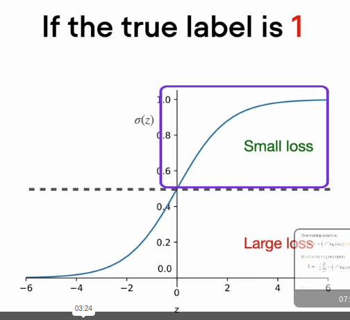

# YOLO


YOLO: Algorithm for Object Detection Explained \[+Examples] ([_V7Labs_](https://www.v7labs.com/blog/yolo-object-detection))



You Only Look Once (YOLO) achieved SoTA results in real-time detectors in 2015. A family of detectors emerged since then:

<figure><figcaption></figcaption></figure>

The YOLO architecture is simple:&#x20;

* 24 convolutional layers and two end FC layers.
* The first 20 layers are pre-trained on Imagenet with half-resolution images
* Then it's trained on detection with full-resolution images

<figure><figcaption></figcaption></figure>

* YOLO divides the input image into a S × S grid&#x20;
* and predicts B bounding boxes of the same class, along with its confidence for C different classes per grid element
* Each bbox prediction consists of five values: Pc, bx, by, bh, bw (Pc is the confidence score)

<figure><figcaption></figcaption></figure>

